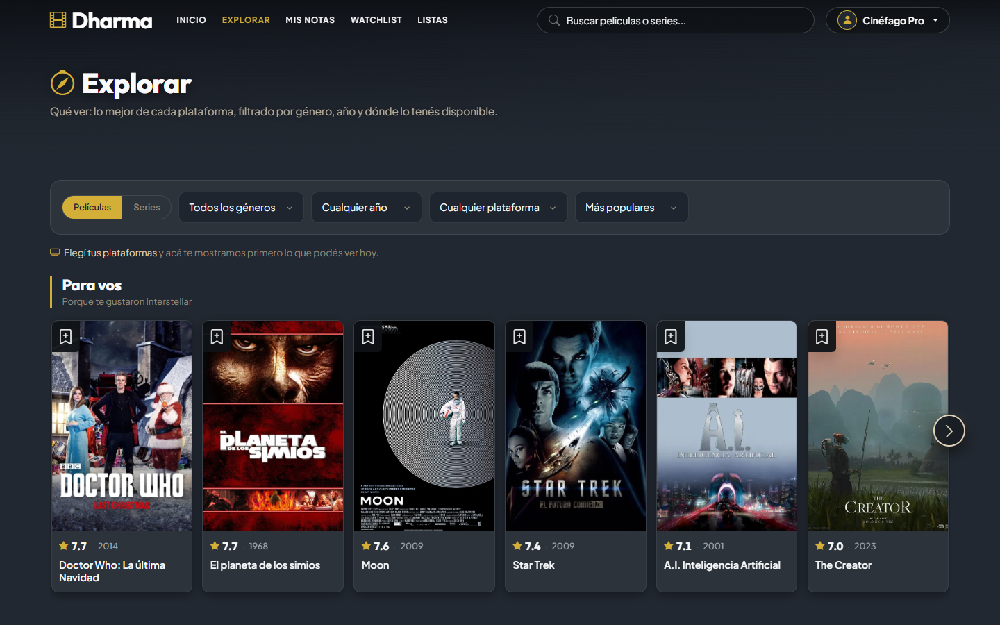
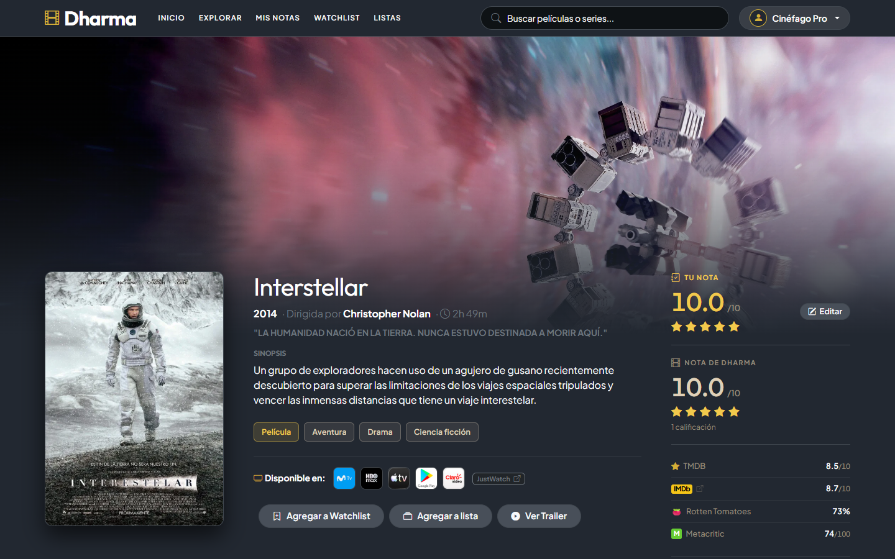
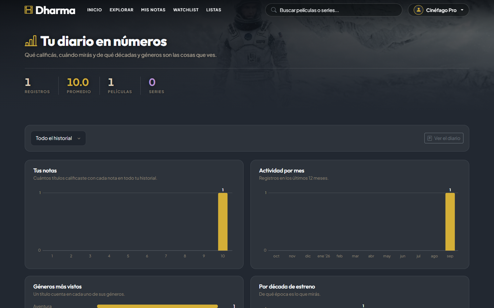

# Dharma

Diario y plataforma de cine y series. Buscá títulos, puntuá y reseñá lo que viste, armá tu watchlist y tus listas, y mirá estadísticas de tu diario. Los datos de catálogo vienen de TMDB y OMDb.

## Capturas

| Inicio | Explorar |
| --- | --- |
|  |  |

| Detalle de un título | Diario |
| --- | --- |
|  |

| Estadísticas |
| --- |
|  |

## Funcionalidades

- **Explorar y buscar** títulos, con panel de personas (reparto y equipo) y tráiler.
- **Diario**: puntuación con estrellas, reseñas, revisionados y estadísticas con gráficos.
- **Watchlist**: notas, disponibilidad en tus plataformas de streaming y elección al azar.
- **Listas** personalizadas, con orden manual por drag & drop.
- **Recomendaciones** a partir de lo que ya viste.
- **Ajustes**: plataformas de streaming del usuario.

## Stack

Laravel 13 (PHP 8.3) · Blade · HTMX 2 · Bootstrap 5 · SCSS · Vite · SQLite · PHPUnit

## Instalación

```bash
git clone <url-del-repo> dharma
cd dharma
composer install
npm install
cp .env.example .env
php artisan key:generate
touch database/database.sqlite
php artisan migrate --seed
npm run build
php artisan serve
```

### Claves de API

Dharma necesita claves propias, que **no** se incluyen en el repo. Cargalas en `.env`:

| Variable | Dónde conseguirla |
| --- | --- |
| `TMDB_API_KEY`, `TMDB_READ_TOKEN` | https://www.themoviedb.org/settings/api |
| `OMDB_API_KEY` | https://www.omdbapi.com/apikey.aspx |

## Tests

```bash
php artisan test
```

## Estructura

- `app/Services`: acceso a TMDB/OMDb, catálogo, descubrimiento y recomendaciones.
- `app/Http/Controllers`: controladores; responden HTML completo o fragmentos HTMX.
- `resources/scss`: estilos organizados por base, componentes y páginas.
- `resources/js/modules`: módulos JS vanilla (toasts, slider, rater, etc.).

Este producto usa la API de TMDB pero no está avalado ni certificado por TMDB.

## Licencia

MIT. Ver [LICENSE](LICENSE).
